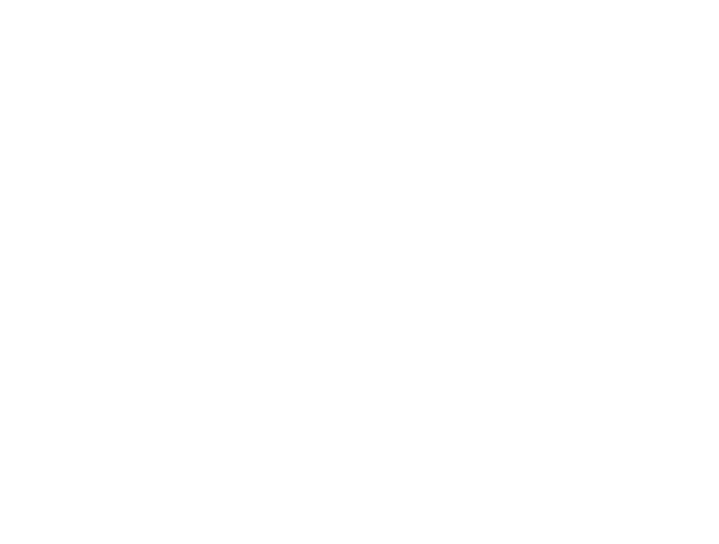
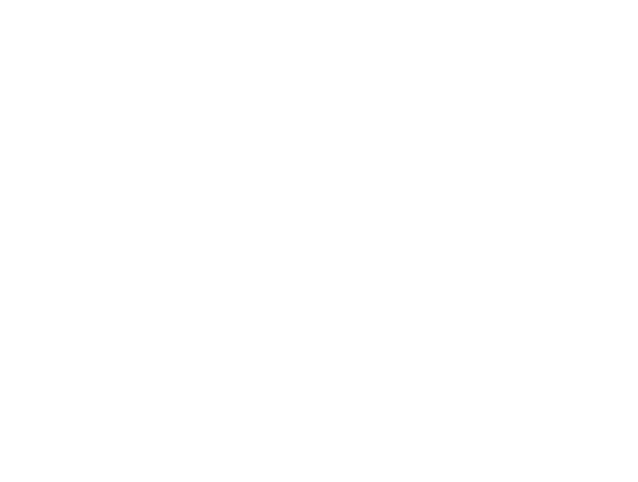
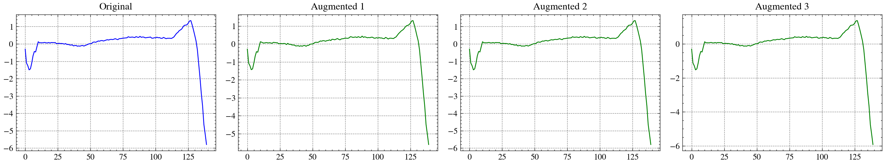
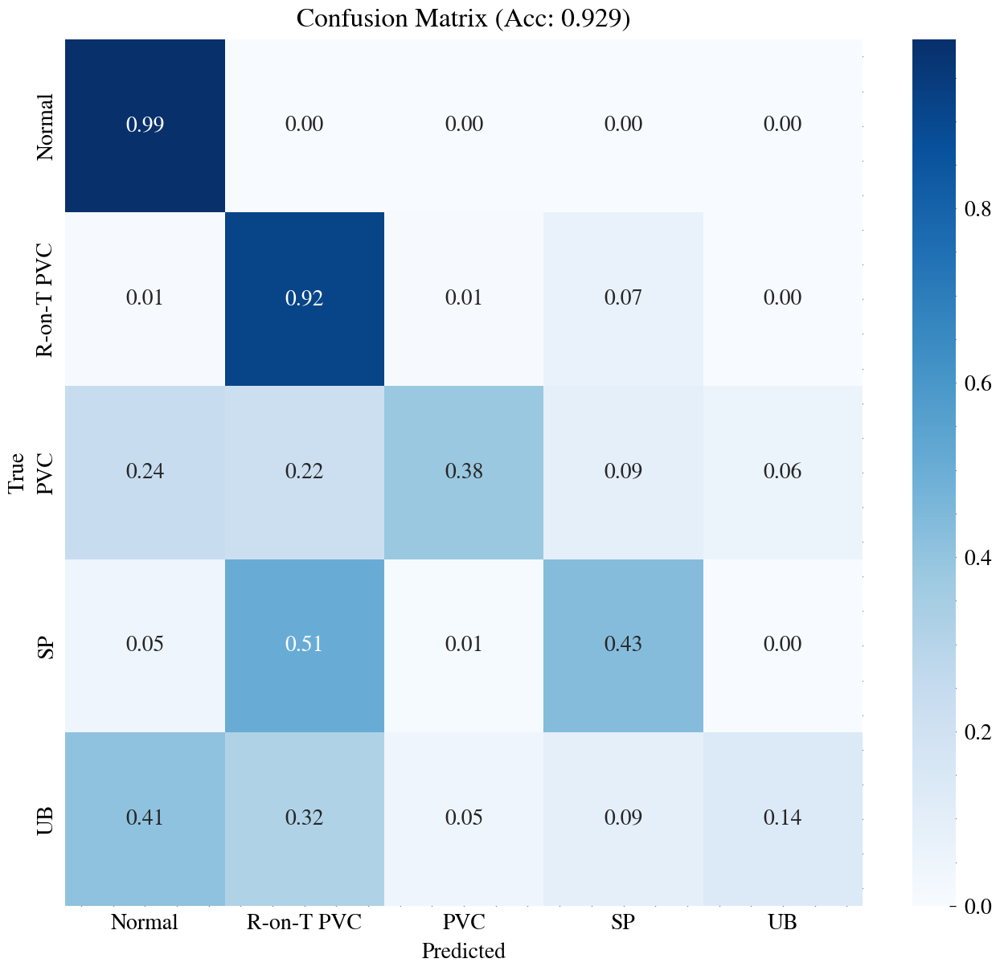
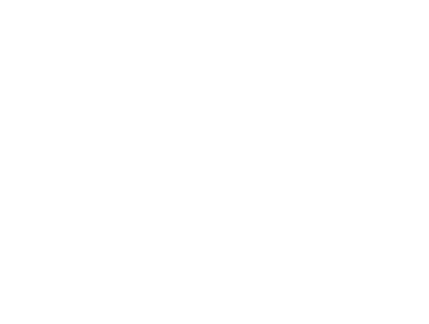
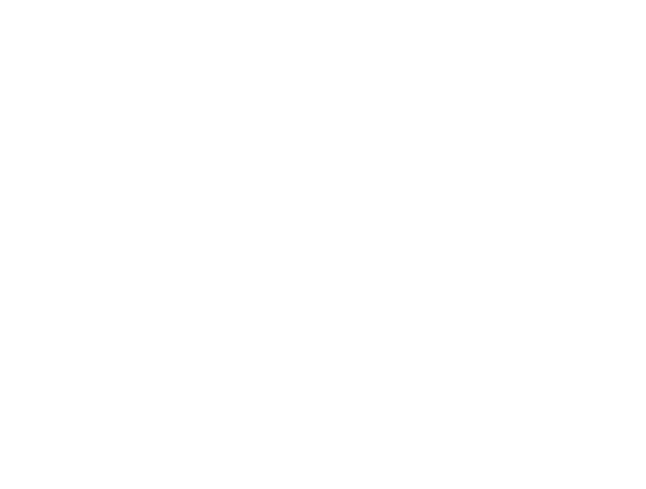
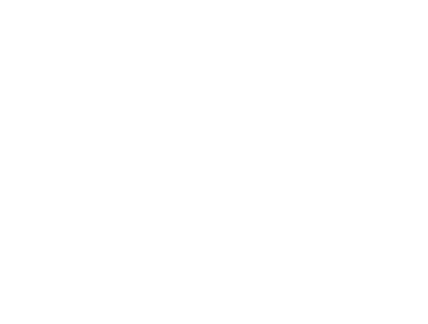
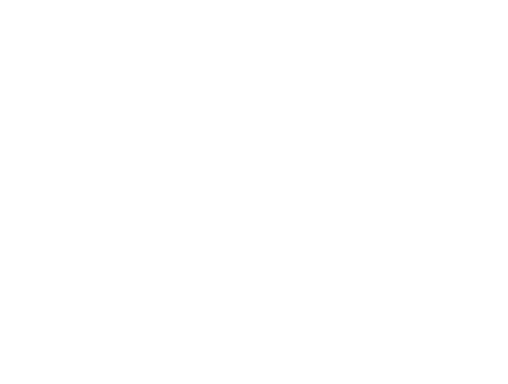

# ECG5000 with MILLET (Notebook Walkthrough)

This README is a simple write-up of what I did in `notebooks/ecg.ipynb`.

Main objective for this work:

- show how MILLET interpretation works on ECG5000
- not to fully optimize minority-class performance yet

---

## 1) Project structure (important files/folders)

- `notebooks/ecg.ipynb`  
  Main notebook used for this experiment (data loading, augmentation, training, evaluation, interpretation).

- `millet/data/ecg5000_dataset.py`  
  ECG5000 dataset class and utilities.

- `millet/model/millet_model.py`  
  MILLET model wrapper.

- `millet/model/backbone/inceptiontime.py`  
  InceptionTime feature extractor used in the notebook.

- `millet/model/pooling.py`  
  Conjunctive pooling and interpretation behavior.

- `model/ECG5000/Balanced_ECG5000.pth`  
  Trained weights saved from notebook.

- `assets/ecg_plots/`  
  Exported images from the ECG notebook outputs (used in this README).

---

## 2) End-to-end flow (what was done)

1. Setup Python + plotting style.
2. Load ECG5000 train/test.
3. Visualize one signal per class.
4. Check class distribution and imbalance.
5. Apply simple augmentation to minority classes.
6. Build balanced training data.
7. Build model (InceptionTime + MIL pooling).
8. Train and save model.
9. Evaluate using confusion matrix.
10. Run interpretation plots for normal and minority examples.

---

## 3) Plots and explanations (2 columns)

| Plot                                                                               | What it means                                                                                                                                                                                                                                             |
| ---------------------------------------------------------------------------------- | --------------------------------------------------------------------------------------------------------------------------------------------------------------------------------------------------------------------------------------------------------- |
|                           | **Title:** `Class 0..4` shows one sample heartbeat from each class. **X-axis:** time step. **Y-axis:** amplitude. **Blue line:** raw ECG waveform. This helps us see each class has different pattern shape.                                              |
|                   | Left graph: class counts in training set. Right graph: percentage split. **Red bars in count plot:** classes below threshold line (minority). **Orange dashed line:** threshold (=50). This confirms heavy imbalance in train set, especially PVC/SP/UB.  |
|                     | Same idea as training distribution but for test set. Test still has imbalance (UB is very small), so minority evaluation is unstable and harder.                                                                                                          |
|                       | **Blue:** original signal. **Green:** augmented versions. In this notebook augmentation is simple (noise + scaling). It increases training samples for minority classes but does not fully solve class overlap.                                           |
|                       | **Rows:** true class. **Columns:** predicted class. **Darker blue cell:** higher proportion. Diagonal = correct classification. Off-diagonal = confusion. Here overall accuracy is high (`0.929`), but minority classes still have lower diagonal values. |
|      | Top: input ECG sample with true/pred label. Bottom: contribution scores for predicted class. **Green bars:** positive contribution to predicted class. **Red bars:** negative contribution. This is the main MILLET interpretation output.                |
|   | Top row repeats same signal for each class view. Bottom row shows class-wise importance map. This helps compare why model prefers one class over others on same sample.                                                                                   |
|  | Interpretation for a minority-class sample. Useful to inspect where model focuses when minority prediction is wrong or uncertain.                                                                                                                         |
|       | Class-wise comparison for minority sample. Shows stronger confusion patterns across R-on-T/PVC/SP/UB compared to Normal class.                                                                                                                            |

### Short conclusion after important graphs

- Distribution plots clearly show data imbalance.
- Confusion matrix shows high total accuracy but poor minority recall.
- Interpretation plots are useful to understand model decisions beyond final label.

---

## 4) Observed performance from notebook

From confusion matrix in notebook:

- Overall accuracy: **0.929**
- Approx class-wise recall (diagonal of normalized confusion matrix):
  - Normal: **0.99**
  - R-on-T PVC: **0.92**
  - PVC: **0.38**
  - SP: **0.43**
  - UB: **0.14**

So, normal and R-on-T are strong, but PVC/SP/UB are much weaker.

---

## 5) Why PVC, SP, UB are low

Main reasons in this run:

1. **Very few samples**, especially UB.
2. **Class overlap** in waveform morphology among minority classes.
3. **Simple augmentation** (noise/scale) may not create enough realistic variation.
4. Even with balanced sampling, model still sees stronger and cleaner patterns for majority classes.

---

## 6) Comparison with the original MILLET paper (practical view)

This notebook result is **consistent in direction** with what the MIL interpretation idea tries to show:

- we can inspect time-step level evidence (positive/negative contribution)
- model behavior is more explainable than plain black-box output

About pure classification numbers:

- direct number-to-number comparison with paper is not strictly fair unless protocol is matched exactly (same preprocessing, same splits/seed setup, same training strategy and tuning)
- in this notebook run, majority classes are strong but minority classes are still difficult

So this README focuses more on the **interpretability objective**, which is the current target.

---

## 7) If we want to improve later (not current objective)

Possible improvements for PVC/SP/UB:

- stronger augmentation for time-series (time warping, window slicing, mixup variants)
- focal loss or class-balanced focal loss
- better minority-aware sampling strategy
- tune decision threshold per class
- add calibration + confidence filtering
- try longer training with early stopping and better validation for minority metrics

Again, for this task we are prioritizing interpretation quality and analysis.

---

## 8) Limitations

- Single notebook-style experiment, not a full benchmark pipeline.
- Minority classes are extremely small in train data.
- Reported values are from this run only.

---

## 9) Easy final conclusion

In short, this ECG5000 notebook successfully shows MILLET interpretation on real ECG classes.  
The model gives high overall accuracy, but minority classes (PVC, SP, UB) are still hard.  
The most important output here is not only prediction score, but also **where the model is looking in time steps** using green/red contribution bars.
